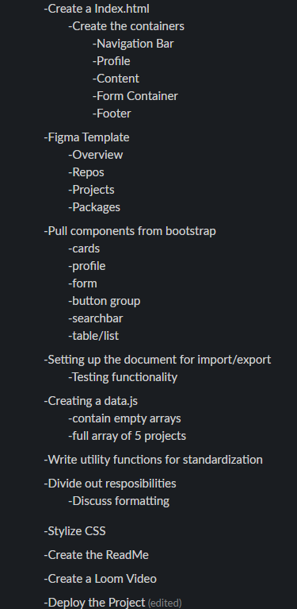

Name of the Project: Git-Sub
Overview of the project
Link to your wireframes/prototype: https://www.figma.com/file/8vIX1yEXd2UxdWARbWqAje/GitSub?type=design&node-id=0-3&mode=design&t=2VV28nK4JIUIYW3B-0
Link/screenshot of data flowchart: 

Link to the deployed project:
Link to your project board: https://github.com/orgs/nss-evening-cohort-24/projects/2/views/1
Description of the user and the problem you are solving for them
Example 1: As a developer, it is important to understand the concepts of multi-page rendering, complex data structures, form submission, tables, and flex-box CSS styling.
Example 2: The user for my application is a developer who wishes to pin repositories, create packages, and display projects for retention and collaboration.
List of features: This project includes 4 different pages (overview, repos, projects, and packages). The user can utillize a form to pin repositories, create a new project, and submit packages. They can also use the navigation bar to move in-between pages with ease. 
Screenshots of your project:
List of contributors and links to their GH profiles
  Shari Ebach: https://github.com/GitEbachS
  Jerrod Spiceland: https://github.com/JSPICELA
  Courtney Fairall: https://github.com/cnfairall
  Luca Bonini: https://github.com/Bonni535
  Johnny Saniat: https://github.com/JohnnySaniat
Link to Loom video walkthrough:
